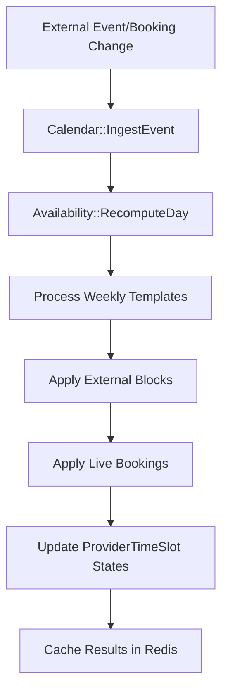
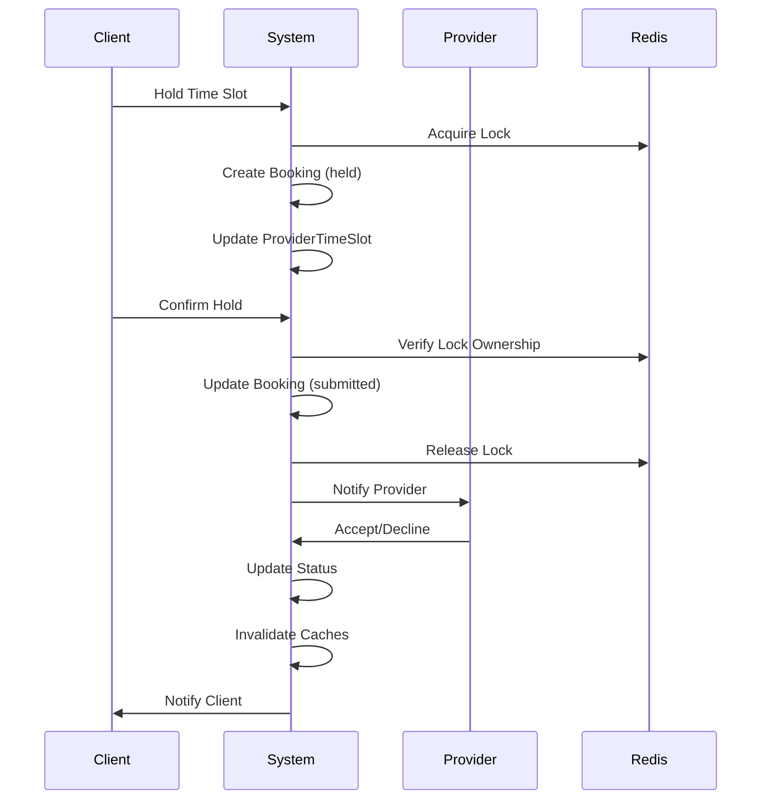

# Flare-ish: Provider Availability & Booking System

A Ruby on Rails application that manages provider availability, handles external calendar integration, and provides a robust booking system with distributed locking.

## 🏗️ Architecture Overview

The system is built around three core concepts:
- **Providers**: Service providers with timezone-aware availability
- **Time Slots**: Generic time periods that can be assigned to providers
- **Bookings**: Client appointments that consume provider time slots

## 📁 Core Modules

### **Availability Management**

#### `Availability::RecomputeDay`
- **Purpose**: Calculates provider availability for a specific date
- **Key Features**:
  - Processes weekly templates to generate candidate time slots
  - Applies external blocks (busy periods from external calendars)
  - Handles live bookings (held, submitted, accepted)
  - Maintains state precedence: `booked > held > blocked > open`
- **Usage**: Called when external events change or bookings are modified

#### `Availability::FetchRange`
- **Purpose**: Retrieves provider availability for a date range
- **Key Features**:
  - Redis caching with database fallback
  - Hybrid sync/async recomputation for large ranges
  - Efficient batch processing for multiple dates
- **Usage**: API endpoint for fetching availability

#### `Availability::ReconciliationJob`
- **Purpose**: Periodic job to ensure availability data consistency
- **Key Features**:
  - Solves "cold start" problem for new providers
  - Populates `ProviderTimeSlot` records for future dates
  - Runs automatically via cron/scheduler

### **External Calendar Integration**

#### `Calendar::IngestEvent`
- **Purpose**: Processes webhook payloads from external calendar systems
- **Key Features**:
  - Identifies existing bookings by `external_event_id`
  - Creates or updates `ExternalBlock` records
  - Handles booking time slot changes
  - Triggers availability recomputation
- **Usage**: Webhook endpoint for external calendar updates

#### `ExternalBlock`
- **Purpose**: Represents busy periods from external calendars
- **Key Features**:
  - UTC-based time ranges
  - Source tracking (Google, Outlook, etc.)
  - Affects provider availability calculation

### **Booking Lifecycle Management**

#### `Bookings::HoldService`
- **Purpose**: Temporarily reserves a time slot for a client
- **Key Features**:
  - Redis distributed locking to prevent double-booking
  - Creates booking with 'held' status
  - Updates `ProviderTimeSlot` state to 'held'
- **Usage**: First step in booking process

#### `Bookings::ConfirmService`
- **Purpose**: Confirms a held booking
- **Key Features**:
  - Verifies lock ownership
  - Changes booking status to 'submitted'
  - Releases Redis lock
  - Notifies provider
- **Usage**: Client confirms their hold

#### `Bookings::AcceptService` / `Bookings::DeclineService`
- **Purpose**: Provider accepts or declines submitted bookings
- **Key Features**:
  - Updates booking status and time slot state
  - Invalidates availability caches
  - Sends notifications to clients
- **Usage**: Provider responds to booking requests

#### `Bookings::CancelService`
- **Purpose**: Client cancels an existing booking
- **Key Features**:
  - Restores time slot to 'open' state
  - Updates booking status to 'cancelled'
  - Clears caches and notifies provider

### **Data Models & Relationships**

#### Core Models
- **`Provider`**: Service providers with timezone and service type
- **`TimeSlot`**: Generic time periods (timezone-aware, includes DST handling)
- **`ProviderTimeSlot`**: Links providers to time slots with availability state
- **`Booking`**: Client appointments with lifecycle status
- **`WeeklyTemplate`**: Provider's recurring availability schedule
- **`Client`**: Service consumers
- **`Account`**: Authentication and user management

#### Key Relationships
- Provider → has_many → ProviderTimeSlot → has_one → Booking
- Provider → has_many → WeeklyTemplate
- Provider → has_many → ExternalBlock
- TimeSlot → has_many → ProviderTimeSlot
- Client → has_many → Booking
- Account → belongs_to → Provider/Client (mutually exclusive)


### **Authentication & Authorization**

#### `Authenticable` Concern
- **Purpose**: JWT-based authentication for API endpoints
- **Key Features**:
  - Token validation and decoding
  - Account role-based access control
  - Automatic user identification

#### `Account` Model
- **Purpose**: Centralized user authentication
- **Key Features**:
  - Secure password storage (bcrypt)
  - Role-based access (admin, provider, client)
  - JWT token management

### **Infrastructure & Utilities**

#### `RedisLock`
- **Purpose**: Distributed locking for booking operations
- **Key Features**:
  - TTL-based expiration
  - Metadata storage (account/client info)
  - Conflict prevention for concurrent bookings

#### `TimeSlots::EnsureForTimezone`
- **Purpose**: Generates time slot records for specific timezones
- **Key Features**:
  - Handles DST transitions
  - Creates slots for configurable time horizon
  - Idempotent operation

## 🔄 System Flows

### **Availability Calculation Flow**


### **Booking Lifecycle Flow**


## API Endpoints

### **Authentication**
- `POST /v1/auth/sign_in` - User sign in
- `POST /v1/auth/sign_up_client` - Client registration
- `POST /v1/auth/sign_up_provider` - Provider registration

### **Providers**
- `GET /v1/providers` - List providers (with optional time slot filtering)
- `GET /v1/providers/:id/availability` - Get provider availability for date range

### **TimeSlots**
- `GET /v1/time_slots` - List system time slots scoped to specific timezone

### **Bookings**
- `POST /v1/bookings/hold` - Hold a time slot
- `POST /v1/bookings/:id/confirm` - Confirm a held booking
- `POST /v1/bookings/:id/cancel` - Cancel a booking
- `POST /v1/bookings/:id/accept` - Provider accepts booking
- `POST /v1/bookings/:id/decline` - Provider declines booking
- `GET /v1/bookings/me` - Get current user's bookings

### **External Integration**
- `POST /v1/calendar_webhooks` - External calendar webhook endpoint

## 🛠️ Development & Deployment

### **Prerequisites**
- Ruby 3.3+
- Rails 8.0+
- Redis
- PostgreSQL
- Sidekiq (for background jobs)

### **Environment Setup**
```bash
# Install dependencies
bundle install

# Setup database
rails db:create db:migrate db:seed

# Start Redis
redis-server

# Start Sidekiq (in separate terminal)
bundle exec sidekiq

# Start Rails server
rails server
```

### **Key Configuration Files**
- `config/database.yml` - Database configuration
- `config/redis.rb` - Redis connection settings
- `config/sidekiq.yml` - Background job configuration
- `config/sidekiq_cron.yml` - Scheduled job configuration

### **Background Jobs**
- `CleanupExpiredHoldsJob` - Removes expired holds every 5 minutes
- `Availability::ReconciliationJob` - Ensures availability data consistency
- `NotifyProviderJob` / `NotifyClientJob` - Send notifications

## 🔧 Maintenance & Operations

### **Scheduled Tasks**
- **Every 5 minutes**: Clean up expired holds
- **Daily**: Reconcile availability data for all providers
- **On-demand**: Manual availability recalculation

### **Monitoring & Debugging**
- Redis lock status monitoring
- Availability calculation logs
- External calendar integration logs
- Background job execution tracking


## 🧪 Testing

### **Test Data**
- Seeded providers in different timezones
- Weekly templates (Mon-Fri schedules)
- Time slot generation for multiple timezones
- Sample external blocks and bookings

### **Key Test Scenarios**
- Availability calculation with external blocks
- Booking lifecycle (hold → confirm → accept/decline)
- Concurrent booking attempts
- Timezone handling and DST transitions
- External calendar integration

## 🔒 Security Considerations

- JWT token expiration and rotation
- Redis lock TTL management
- Role-based access control
- Input validation and sanitization
- Secure password storage

## Performance & Scalability

- Redis caching for availability data
- Batch processing for large date ranges
- Asynchronous job processing
- Database query optimization with includes
- Efficient time slot generation

##

This system provides a robust foundation for managing provider availability with external calendar integration, distributed booking management, and comprehensive state management for complex scheduling scenarios.